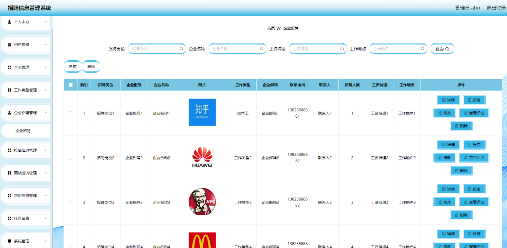

## 简介

基于SpringBoot+Vue的招聘信息管理系统、**前后端分离**

 - 开发语言：Java 
 - 数据库：MySQL 
 - 技术：SpringBoot、Vue、Mybaits Plus、ELementUI
- 工具：IDEA/Ecilpse、Navicat、Maven
- **QQ:3270728362**

【主要功能】

角色：管理员、用户、企业

- 用户：首页、个人中心、投简信息管理、面试邀请管理、求职信息管理等。
- 企业：首页、个人中心、企业招聘管理、投简信息管理、面试邀请管理等。
- 管理员：首页、个人中心、用户管理、企业管理、工作类型管理、企业招聘管理、投简信息管理、面试邀请管理、求职信息管理、社区留言、系统管理等。

----

## 系统展示

>首页，可以看到招聘企业、求职信息、新闻资讯等信息。

> 企业招聘界面，可以看到所有的招聘企业，并可以按工作类型、工资待遇、工作地点等进行查询搜索。

> 求职信息聘界面，可以看到所有的求职者信息，并可以按姓名、手机号等进行查询搜索。

>管理员界面

